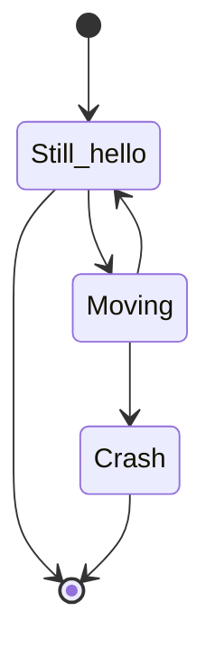

# hey hello world

aasdasdasdasd

*   asd
    
*   asd
    
*   asd
    
*   asd
    

`📄 algorithms/search/binary_search.py`

[test doc](test-doc.55po3.sw.md)
<!-- NOTE-swimm-snippet: the lines below link your snippet to Swimm -->
### 📄 main_test.py
```python
🟩 1      if __name__ == '__main__':
🟩 2          print("hello world")
```

<br/>

<br/>

<br/>

# here is a parking lot with only one empty spot. Given the initial state<br/>
of the parking lot and the final state. Each step we are only allowed to<br/>
move a car.

<!-- empty line --><br/>
out of its place and move it into the empty spot.<br/>
The goal is to find out the least movement needed to rearrange<br/>
the parking lot from the initial state to the final state.

`Say the initial state is an array:<br/> [1, 2, 3, 0, 4],<br/> where 1, 2, 3, 4 are different cars, and 0 is the empty spot.<br/> And the final state is<br/> [0, 3, 2, 1, 4].`

<!-- empty line --><br/>
We can swap 1 with 0 in the initial array to get \[0, 2, 3, 1, 4\] and so on.<br/>
Each step swap with 0 only.

<!-- empty line --><br/>
Edit:<br/>
`Now also prints the sequence of changes in states.<br/> Output of this example :-<br/> initial: [1, 2, 3, 0, 4]<br/> final: [0, 3, 2, 1, 4]<br/> Steps = 4<br/> Sequence :<br/> 0 2 3 1 4<br/> 2 0 3 1 4<br/> 2 3 0 1 4<br/> 0 3 2 1 4`
<!-- NOTE-swimm-snippet: the lines below link your snippet to Swimm -->
### 📄 algorithms/arrays/garage.py
```python
⬜ 32     """
⬜ 33     
⬜ 34     
🟩 35     def garage(initial, final):
🟩 36     
🟩 37         initial = initial[::]      # prevent changes in original 'initial'
🟩 38         seq = []                   # list of each step in sequence
🟩 39         steps = 0
🟩 40         while initial != final:
🟩 41             zero = initial.index(0)
🟩 42             if zero != final.index(0):  # if zero isn't where it should be,
🟩 43                 car_to_move = final[zero]   # what should be where zero is,
🟩 44                 pos = initial.index(car_to_move)         # and where is it?
🟩 45                 initial[zero], initial[pos] = initial[pos], initial[zero]
🟩 46             else:
🟩 47                 for i in range(len(initial)):
🟩 48                     if initial[i] != final[i]:
🟩 49                         initial[zero], initial[i] = initial[i], initial[zero]
🟩 50                         break
🟩 51             seq.append(initial[::])
🟩 52             steps += 1
🟩 53     
🟩 54         return steps, seq       
🟩 55         # e.g.:  4, [{0, 2, 3, 1, 4}, {2, 0, 3, 1, 4}, 
🟩 56         #            {2, 3, 0, 1, 4}, {0, 3, 2, 1, 4}]
🟩 57     
⬜ 58     """
⬜ 59     thus:
⬜ 60     1 2 3 0 4 -- zero = 3, true, car_to_move = final[3] = 1,
```

<br/>

/

<br/>

<!--MERMAID {width:50}-->

<!--MCONTENT {content: "stateDiagram-v2<br/>\n\\[\\*\\] \\-\\-\\> Still\\_hello<br/>\nStill\\_hello \\-\\-\\> \\[\\*\\]<br/>\nStill\\_hello \\-\\-\\> Moving<br/>\nMoving \\-\\-\\> Still\\_hello<br/>\nMoving \\-\\-\\> Crash<br/>\nCrash \\-\\-\\> \\[\\*\\]<br/>"} --->

<br/>

This file was generated by Swimm. [Click here to view it in the app](https://app.swimm.io/repos/Z2l0aHViJTNBJTNBYWxnb3JpdGhtcyUzQSUzQWl0YXlnMjU=/docs/ht7dj).