# Report for Assignment 1

## Project chosen

Name: algorithms    

URL: (https://github.com/keon/algorithms)

Number of lines of code and the tool used to count it: 18023(18 KLOC), counted using lizard

Programming language: Python

## Coverage measurement

### Existing tool

We have used coverage.py to measure the cover of our chosen project. After installing all tools and dependencies, we have 
run the tool by typing coverage run --branch -m pytest tests. Afterwards, we use coverage report to generate the report. Later, Ayman has written a scrip to run the commands in a single script, and to also skip the test files, which don't need to be tested.

In order to not put in 8 large images, I will insert the final screenshot, with the total branch coverage:

### Your own coverage tool

#### Ayman Errahmouni

##### Function 1: simplify_path_v2

[Link the commit](https://github.com/CatalinAnt/algorithms-SEP-95/pull/2/commits/22ee6fa1df4785596c603af61a725c558973eb0b)

Screenshot of branch measurement: 

##### Function 2: insertion_sort

[Link to commit](https://github.com/CatalinAnt/algorithms-SEP-95/pull/2/commits/5dae7f28036f89b7f6ff673639a922dd714aff3e)

Screenshot of branch measurement: 
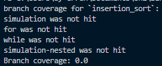

#### Catalin Antonescu

##### Function 1: strong_password
 
Link to commit:
[https://github.com/CatalinAnt/algorithms-SEP-95/commit/eaad6d32ecd73bb8fde876a4d4852cb522aea6f8](https://github.com/CatalinAnt/algorithms-SEP-95/commit/2b0b9187c1c040e4476b1ca14f2c2249273566b7)

Screenshot of branch measurement:

##### Function 2: rotate_image

Link to commit:(same as for the first one)
[https://github.com/CatalinAnt/algorithms-SEP-95/commit/eaad6d32ecd73bb8fde876a4d4852cb522aea6f8](https://github.com/CatalinAnt/algorithms-SEP-95/commit/2b0b9187c1c040e4476b1ca14f2c2249273566b7)

Screenshot of branch measurement:

#### Almuthana Almustafa

##### Function 1: stoogsort in stoog_sort.py

[Link to the commit in the founction files](https://github.com/CatalinAnt/algorithms-SEP-95/commit/57b66879c6ae0f82712c55528f540dfdb3c3ddd3)

result: 

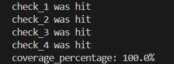

##### Function 2: word_break in word_break.py

link to commit in founction:
[Link to the commit in the founction files](https://github.com/CatalinAnt/algorithms-SEP-95/commit/57b66879c6ae0f82712c55528f540dfdb3c3ddd3 )

result:

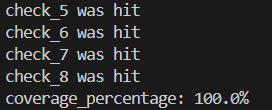

## Coverage improvement

### Individual tests

## Ayman Errahmouni

#### <Test "test_simplify_path">

An enhanced existing test

Old coverage: 
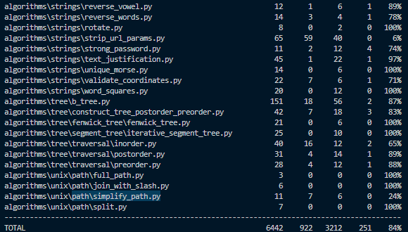

Diff (LHS = new code, RHS = old code): 
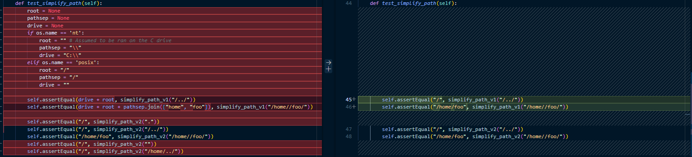
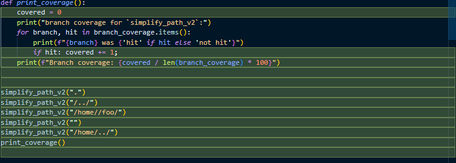

New coverage: 
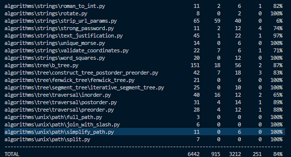

The coverage was improved because certain cases that could happen in file paths (e.g. the "." directory, empty path) were not tested for.
By added additional tests that use such cases, the coverage improved.

The test was also faulty on windows (i guess linux was assumed), so i added support for that in the test. (It now passes on Windows 10 too)

#### <Test "test_actual_insertion_sort">

An new test. (before, `insertion_sort` was not present in any test)

Diff (LHS: new code, RHS: old code): 
(New test) 
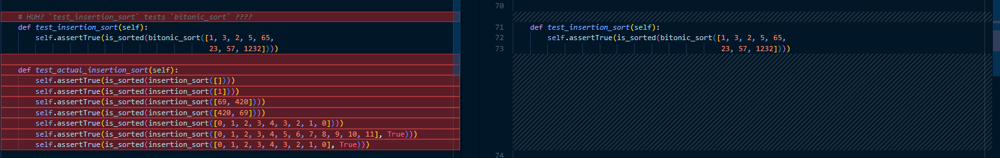 
(Changes in imports) 
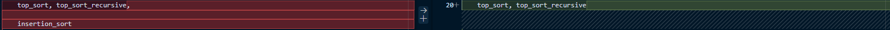
(Instrumentation) 
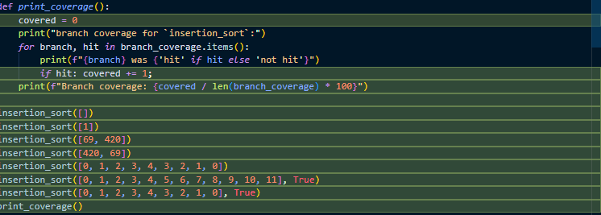

Old coverage: 
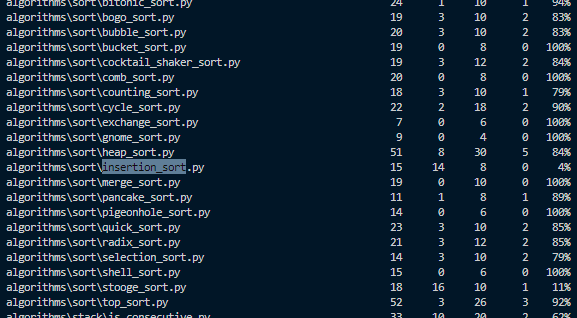

New coverage: 
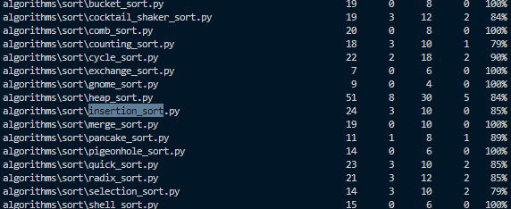

<State the coverage improvement with a number and elaborate on why the coverage is improved>

## Catalin Antonescu

Test 1:

In test_string:

Link to commit:

[https://github.com/CatalinAnt/algorithms-SEP-95/commit/eaad6d32ecd73bb8fde876a4d4852cb522aea6f8](https://github.com/CatalinAnt/algorithms-SEP-95/commit/2b0b9187c1c040e4476b1ca14f2c2249273566b7)

Old coverage:

New coverage:

For strong_password there was a 26% coverage improvement with the existing tool and 40% with manual measurement tool.

Test 2:

In test_matrix:

[https://github.com/CatalinAnt/algorithms-SEP-95/commit/eaad6d32ecd73bb8fde876a4d4852cb522aea6f8](https://github.com/CatalinAnt/algorithms-SEP-95/commit/2b0b9187c1c040e4476b1ca14f2c2249273566b7)

Old coverage:

New coverage:

 For rotate_image, thre was a 33% coverage improvement with the existing tool and 25% with manual tool.

## Almuthana Almustafa

### Test 1: stoogsort

link to commit in test files:
[Link to the commit in the test files](https://github.com/CatalinAnt/algorithms-SEP-95/commit/157de36fd4c373b67cd03e3b3713be9ba5cf0d97)

existing tool result before:

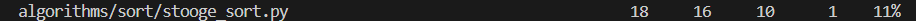

existing tool result after:

The coverage increased by 89%, largely attributable to the implementation of new tests.

### Test 2: word_break

[Link to the commit in the test files](https://github.com/CatalinAnt/algorithms-SEP-95/commit/157de36fd4c373b67cd03e3b3713be9ba5cf0d97)

existing tool result before:

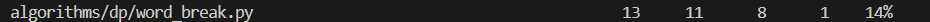

existing tool result after:

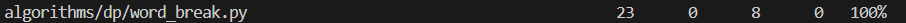

The coverage improved by 86% due to the creation of new tests.

#### Abdullah Abdelkhalik

pythagoras

https://github.com/CatalinAnt/algorithms-SEP-95/commit/5651abafebe8ae3a5ea63e74883bb991acf19303

first_unique_char

https://github.com/CatalinAnt/algorithms-SEP-95/commit/c16f26e952322b2c1729778a4141a57103ba7658

##  Improvements

test_maths

https://github.com/CatalinAnt/algorithms-SEP-95/commit/60832d9c672efd586848077cc41a52630d34371b

the coverage is improved by 28%, the code only hit one of the five branches and cover only one of the three cases of the pythagoras theory. I added the other two cases, i could have a fourth case where none of the cases is present.

test_strings

https://github.com/CatalinAnt/algorithms-SEP-95/commit/5651abafebe8ae3a5ea63e74883bb991acf19303

The coverage is improved by 13%, the code only hit three out of five branches and only set up two examples. I added a case where there is no unique letter.

### Overall

<Provide a screenshot of the old coverage results by running an existing tool (the same as you already showed above)>
Old overall coverage:

<Provide a screenshot of the new coverage results by running the existing tool using all test modifications made by the group>
New overall coverage:
 

Due to the large size of the project, the percentage only went up by one percent.

## Statement of individual contributions

<Write what each group member did>

Abdullah -> increased the coverage for two functions.

Almuthana Almustafa -> Instrumentation was added to two functions, and test cases were created for them to improve coverage.

Cataline -> Instrumentation was added to two functions, and the tests for these functions were enhanced.

