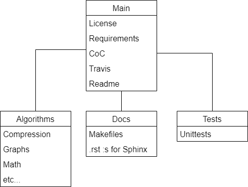

# Project Overview
The purpose of the project is to provide clean and minimalistic implementations of basic algorithms and data structures in Python 3. The project is licensed under the MIT license which allows the use of the code for educational and commercial purposes. The project uses Sphinx to generate documentation, github actions for continuous delivery, flake8 for linting and pytest for unit testing.

## A more detailed project explanation
The project [root folder](./) contains various documentation and settings oriented files such as the readme and the license. We also find config files such as the .gitignore and requirement files for installation of package dependencies. It also contains configuration files for continuous delivery through github actions in the form of .yml files. Apart from this there are three main folders. The first is a folder which hosts all the [algorithms](./algorithms/). This is the main folder of the repository. The second is a folder called [docs](./docs/) which hosts a makefile and a large collection of empty .rst files. The makefile and .rst files allow a user to generate documentation in the form of browsable html-documents or linux man-pages. The third folder of importance is the [tests](./tests/) folder. It hosts all the 394 unittests for the project.

## A note about continuous integration
As mentioned above the project uses flake8 to perform linting and pytest to perform unit testing for the project. This is set up to run automatically when node code is deployed. This is set up with the help of the .yml configuration file in the [github workflow](./github/workflows/) directory. In order to work, the automated testing relies on certain external packages. These packages are listed in the file [test_requirements](./test_requirements.txt). Githubs continuous integration solution then installs all required dependencies and executes the linting script with flake8 and the tests with pytest.

## A note about the project code of conduct
In the last years there has been a push to professionalize open source software projects. Part of that process is to establish firmer rules on the behaviour of the contributors. This has lead to the inclusion of code of conducts in many projects. This project is no different and has standardized what behaviour is expected by all contributors in the project's [code of conduct](./CODE_OF_CONDUCT.md).