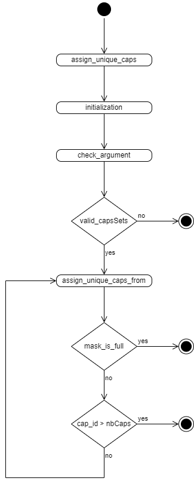
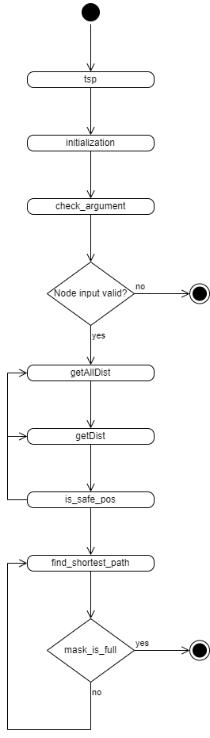

# Report for assignment 4

This is a template for your report. You are free to modify it as needed.
It is not required to use markdown for your report either, but the report
has to be delivered in a standard, cross-platform format.

## Project

Name: keon/algorithms

URL: The forked repo can be found in [this link](https://github.com/AmandaStromdahl/algorithms).

The chosen project is a Python repository that implements various algorithms and data structures.

## Onboarding experience

For this task our group chose a new project to work with. The onboarding experience between the two projects are distinctly different. The last repository we worked with was quite minimalistic in terms of basic usage instructions. For example did the last repository not explain how to run the tests. This repository on the other hand clearly states how to run the tests, install dependencies and so on. Eeach implemented algorithm is also conveniently listed in the readme. Overall the onboarding experience is a lot smoother compared to the last project.

## Effort spent

For each team member, how much time was spent in

1. plenary discussions/meetings;

2. discussions within parts of the group;

3. reading documentation;

4. configuration and setup;

5. analyzing code/output;

6. writing documentation;

7. writing code;

8. running code?

For setting up tools and libraries (step 4), enumerate all dependencies
you took care of and where you spent your time, if that time exceeds
30 minutes.

## Overview of issue(s) and work done.

Title: "Add Bitmasking in DP #480"

URL: The issue can be found in [this link](https://github.com/keon/algorithms/issues/480).

The task is to implement algorithms that employ bitmasking and dynamic programming. There are a couple of good problems where the solutions can utilize this technique. We choose to implement solutions for the _cap-set_ problem and the _Traveling Salesperson_ problem.

The issue will require a new files to be added to the dp-folder. Since the implementation doesn't already exist in the repo, no existing code will be affected. Each algorithm will most likely require one or more helper functions. The scope of the issue is small enough to be able to finish the issue within a few days.

### Cap-set

In this problem we want to assign unique caps to a set of people, where each person has their own set of available caps.

#### Algorithm description

To solve this problem, we will use bitmasking and dynamic programming. Bitmasking is used to represent subsets of a collection of elements as bits sequences called _masks_. In these sequences, a bit set to 1 means that the associated element is part of the subset. More specifically, if the _i-th_ bit is set to 1, then the _i-th_ element is part of the subset defined by this sequence. For example, if we have a collection of 10 elements, the bits sequence 0111010000 means that the associated subset contains element 2, 3, 4 and 6.

In our case, bitmasking will be used to represent whether a person is wearing a hat. In other words, a _i-th_ bit set to 1 means that the _i-th_ person is wearing a hat. Therefore the final cases we're interested into are the ones when the mask is completely full, i.e. all bits are set to 1.

Let's have a look on the dynamic programming formula. The table storing the intermediate results is a  matrix where:

- M is the total number of masks, which is equal to  where n is the number of people
- N is the total number of hats

And so the formula goes as follow:

`countWaysUntil(mask, k_hat) = countWaysUntil(mask, k_hat + 1) + `` countWaysUntil(mask | (1 << i), k_hat + 1)`

More specifically, this formula says that the number of ways satisfying the problem for a specific mask (i.e. hat wearing status of the people) and taking into account all hats from the _k-th_ one until hat $N$ is defined by the sum of

1. the number of ways satisfying the problem without taking the _k-th_ hat into account
2. the sum of the number of ways satisfying the problem when each person, that have the _k-th_ hat in their collection and are not currently wearing a hat, wears it.

Note that before the computation of the formula, we have to check three cases:

1. if the mask is full, then it means that we found a way of satisfying the problem, hence we return 1
2. if the hat index is bigger than the total number of hats, it means that there are no more hats left and we could not find a satisfying ways to the problem. Therefore we return 0
3. if the number of ways of the mask and the _k-th_ hat has already been computed, then we just return the result from the dynamic programming table/matrix

Finally the result will be stored is the matrix cell `[0][1]`.

### TSP

The same technique of bitmasking and dynamic programming can be utilized to solve the famous _Travelling Salesperson_ problem. Given a 2D grid containing a set of towns, we want to find the shortest route through all the towns that ends up in the same spot we started from. In our case we model the 2D grid using ascii characters in this way,

```
.  .  .  .  .  *  .
.  .  .  #  .  .  .
.  *  .  #  .  *  .
.  .  .  .  .  *  .
```

where `.` signifies an open road, `*` signifies a town and `#` signifies a blockage. Our starting point is (0,0) (top right corner).

#### Algorithm Description

To solve this problem we first calculate the minimum distance between two cells in the grid, which we can do with a BFS. We pre-compute the distance from our starting point to all of the houses. This is done in O((#houses + 1) \* grid_size) as each BFS is O(grid_size) in the worst case.

We now construct the dynamic programming state `dp[index][mask]`.

- `index` is the location of the current house.
- `mask` tells us which of the houses that we have visited by set bits in the mask.

Together `dp[index][mask]` tells us the minimum distance to visit X (X = number of set bits in mask) houses in a order such that the last visited house is at `index`

Then we have our state transition. Initially `dp[0][0]` means that we are at tile 0 and the mask states that we have visited 0 houses. The final state will be `dp[some index][LIMIT_MASK]` where `LIMIT_MASK = (1 << N) - 1` (N = number of houses). The relation is then,

```
dp(curr_house)(curr_mask) = min(
    for house: houses that hasn't been visited yet:
       dp(house)(cur_mask.set_bit(house)) + dist[curr_house][house]
)
```

When the mask is `LIMIT_MASK` we know that all the houses have been visited, and we can add the distance from the last house to the initial position to our solution.

### Requirements for the new feature or requirements affected by functionality being refactored

Each of the following requirements will be linked to new tests, since no tests related to the issue exist previously. The requirements named R1.x are related to the cap assignment problem, whereas the remaining requirments named R2.x concern the TSP implementation.

| ID   |               Title                |                                                                                                                              Description |
| :--- | :--------------------------------: | ---------------------------------------------------------------------------------------------------------------------------------------: |
| R1.1 |            No cap sets             |                                                                               If the nr of cap sets is 0, a ValueError should be raised. |
| R1.2 |        Person without caps         |                                   If there is at least one person that doesn't have any caps, there should be 0 ways to assign the caps. |
| R1.3 |      No unique cap assignment      |            Assume there are >0 people and at least one cap per person. If there is no unique assignment of caps, the output should be 0. |
| R1.4 | One or more unique cap assignments | Assume there are >0 people and at least one cap per person. If there is at least one unique assignment of caps, the output should be >0. |
| R1.5 |          Too many people           |                                                          If there are too many people (i.e. capSets) then a ValueError should be raised. |
| R1.6 | Faulty CapIds | If any of the cap Ids are not given as an integer a ValueError should be raised.
|
| R1.7 | Faulty collection input | If the cap ids are given as another collection type than a list and error should be raised.
|
| R1.8 | CapId too low | If the provided maximum capId is lower than the highest given cap id this should raise a value error.
|
| R2.1 | No nodes | If the nr of nodes is 0, a ValueError should be raised. |
| R2.2 | One node | If the nr of nodes is 1, the output should be 0. |
| R2.3 | Positive path length | If there are at least two nodes that are >0 length units apart, the output should be a number >0 that corresponds to the length of the shortest Euler circuit. |
| R2.4 | No solution | If the nr of nodes is >1 and there is at least one node that cannot be reached from any other node, the output should be inf. |
| R2.5 | Faulty dimensions | If the dimensions of the given graph don't correspond to the dimension parameters, a ValueError should be raised. |
| R2.6 | Wrong collection type | If the collection of nodes is not a list a ValueError should be raised.
|
| R2.7 | Wrong node type | If a node in the collection is of the wrong type a ValueError should be raised.
|
| R2.8 | Too many houses | Checks that a value error is raised if too many houses are allocated in the input matrix.
|

## Code changes

### Implementation of Cap Assigning Problem

To implement this algorithm, we simply started with the main method and implementing all other methods as we needed:
- `assign_unique_caps()` This is the main method that someone will call to solve the problem given the caps sets and the number. This method will firstly initialize the necessary data calling the `initialization()` function and then actually start the algorithm calling the method `assign_unique_caps_from()` with the appropriate arguments. The implementation was pretty straightforward since we're just calling two methods and doing nothing else.
- `initialization()` This method computes the necessary data such as the number of people, the cap dictionary and the DP matrix. But it first starts by checking that the given caps sets are valid calling the `check_argument()` method. Computing the number of people was trivial, then filling in the cap dictionary consisted of just reading the caps sets and finally the DP matrix was initializes with a size of the number of distinct caps + 1 times the number of masks and filled in with the value -1.
- `check_argument()` This method check that the given caps sets are valid based on the [requirements](#requirements) so it was straightforward.
- `assign_unique_caps_from()` This method the main method of the DP algorithm. It implements the algorithm defined [here](#description).

The overall implementation of this algorithm was clear. We did not encountered some huge bugs or problems when coding it.

### Implementation of Travelling Salesman Problem

To implement this second algoritm, we used the same structure as the first one, that means that we started with the main method and implemented the auxiliary functions as needed.
- `tsp()` This is the main method that we will call to solve the problem given the nodes, the number of rows and the number of columns. The implementation of this method was trivial, as for the first algorithm, we firstly initialize the necessary data using the method `initialization()` and start the the algorithm itself by calling the method `find_shortest_path()`.

- `initialization()` As for the first algorithm, this method computes the necessary data such as the houses location, the DP matrix and all the distances in the grid. But we firstly need to start by checking the arguments using the method `check_argument()`. Then finding the houses in straightforward, we just need to find the "*" in the grid. The DP matrix is defined with a size of the number of masks times the number of houses and filled in with the value -1. We then computed all the distances by calling the method `getAllDist()`. We finally return the computed values.

- `check_argument()` This method as exactly the same purpose as for the first algorithm, that means that it checks the nodes based on the [requirements](#requirements) so it was also trivial.

- `getAllDist()` This method initialize the 3D matrix that will contains all the distances. It has a size of the number of houses times the number of columns times the number of rows. It is filled in with the value infinity. Then we will call the method `getDist()` for all the houses. The code of this method only contains a 3D matrix initialization and a for loop for the houses and finally returns the distances, so the implementation does not caused any problems.

- `getDist()` This method computes all the distances from the given house to all nodes in the grid using the BFS algorithm. When looking for the neighbor nodes of a specific nodes, we use the method `is_safe_pos()` to make sure that the neighbor node is valid. The implementation of this method wasn't straightforward a required some reflexion.

- `is_safe_pos()` This method is trivial, it just checks that the given coordinate is inside the grid and therefore valid.

- `find_shortest_path()` This is the main method of the algorithm. Please refer to the description defined [here](#description).

This last method was the hardest to implement in this assignment, in a sense that the algorithm was not working when trying to run it after we finished the first version. Indeed, the algorithm was outputing infinity for the example defined in the `main()` method. After spending time on this bug, we finally found the problem: we forgot to do a -1 when checking is the mask was full, hence this condition could never be true and so returning a different value than infinity, which means that the problem is unsolvable.

### Patch

(copy your changes or the add git command to show them)

git diff ...

Optional (point 4): the patch is clean.

Optional (point 5): considered for acceptance (passes all automated checks).

## Test results

The repository has initially a [complete folder](tests/) dedicated to the tests, after running the command `python3 -m pytest tests` given in the [README](README.md), we can see that there are already 394 tests implemented. Note that all the tests succeed. To have a bit more information about the initial coverage of the tests, we ran the `coverage.py` tool that we already used for the last assignment. It turns out that the initial coverage is quite good: 89% (961 misses for 8762 statements). These two results have been logged in [this file](initial_tests_log.txt).

Concerning our issue, since it is related to a new algorithm, there are obviously no tests about it. However, we can still have a look on the [tests folder](tests/). We notice that the tests are divided into files, each of which represents a specific algorithms field where the algorithms are separated in the [algorithms folder](algorithms/). For instance, all algorithms related to [graph](algorithms/graph/) are tested in the file [test_graph.py](tests/test_graph.py). Inside one of these test files, the tests are divided into classes, each representing the test class for a specific algorithm. For example, in the test file [test_graph.py](tests/test_graph.py), one of the class is `class TestTarjan` that contains multiple tests for the [_Tarjan's algorithm_](https://en.wikipedia.org/wiki/Tarjan%27s_strongly_connected_components_algorithm).

Hence we create the class that will allow us to test the new algorithm of our issue: 'class `TestBitmasking` in the file [test_dp.py](tests/test_dp.py). Each [requirement](TODO) will have its own method that test it inside this class.

## UML for the Bitmasking algorithms

Our solution consists of modular algorithms that utilizes several functions. In order to gain a better understanding of the control flow of the algorithms the following control-flow diagrams can be consulted. We have chosen control-flow diagrams instead of class diagrams as the solutions we provide do not utilize several classes. In this figure the boxes represent functions called and the diamonds represents major decision points. The filled dot represents the start and the circled dots represent the termination of the algorithms.

The first class [TestBitmaskingCapAssignment](tests/test_dp.py) tests the implementation of the bitmasking algorithm to solve the Cap Assignment problem. The test class has 8 associated requirements which covers aspects such as correct input types, edge cases and runtime correctness. The test class achieves 92% test coverage. After analyzing the functions for the Cap Assignment code with the code complexity tool Lizard we get the following results:

| Function                | Lizard CCN | Manual CCN |
| :---------------------- | :--------: | ---------: |
| check_argument          |     8      |          5 |
| initialization          |     5      |          4 |
| assign_unique_caps_from |     7      |          4 |
| assign_unique_caps      |     1      |          1 |

The slight discrepancy is due to the fact that lizard does not take exceptions raised into account. The generally low degree of complexity shows that our implementation is not overly complex.

The second class [TestBitmaskingTSP](tests/test_dp.py) tests the implementation of the bitmasking algorithm to solve TSP. The test class has 8 associated requirements. The requirements focus on things such as correctness of the input, correction of structure and correct output for valid input. Our tests achieve a 94% code coverage. After analyzing the functions for TSP with the code complexity tool Lizard we get the following results:

| Function           | Lizard CCN | Manual CCN |
| :----------------- | :--------: | ---------: |
| is_safe_pos        |     5      |          5 |
| getDist            |     7      |          7 |
| getAllDist         |     5      |          5 |
| check_argument     |     10     |          5 |
| initialization     |     7      |          6 |
| find_shortest_path |     5      |          3 |
| tsp                |     1      |          1 |

The general complexity of most of these functions are also low. The main difference between the manually counted CCN and the CCN computed by Lizard is the fact that Lizard does not take exceptions into account. Thus we have a much higher complexity for the check_argument function when tested with Lizard than when it's analyzed manually.

| UML for the cap counting problem. | UML for TSP |
| :-------------------------------- | :---------- |
 |  |

### Key changes/classes affected

The project is overall highly modular where each algorithm is contextually independent from the others. This holds true for our implementation of the bitmasking algorithm. Given that we did not introduce any new dependencies to the project the impact of our addition on the existing code base is minimal. The tests for the bitmasking algorithm are implemented using the same test framework as the existing tests and conforms to the overall design of the project.

## Overall experience

In the final assignment of this course we got the opportunity to apply many tools and practices from earlier assignments. To begin with, we maintained several Github practices from assignment 1, such as using the issue tracker diligently and making sure to reference an issue in (almost) every commit. Furthermore, we used Github actions for continuous integration, which relates to assignment 2. Finally, we reflected over the team work in relation to the Essence standard, as we have done in every assignment in this course.

The main take-away from this assignment, and from the course in general, is that there is more to solving an issue than simply completing the task itself. If the issue is complex enough, it might be suitable to plan the work ahead of time (e.g. using the issue tracker) and documenting the process along the way. Additionally, it's important to apply the right practices, such as branching correctly, in order to make sure the work is efficient and risk-free.

Overall, the assignment seemed like a positive step towards bridging the gap between education and real-world programming.

---

Our team evaluation is available in [this file](Essence.pdf)
